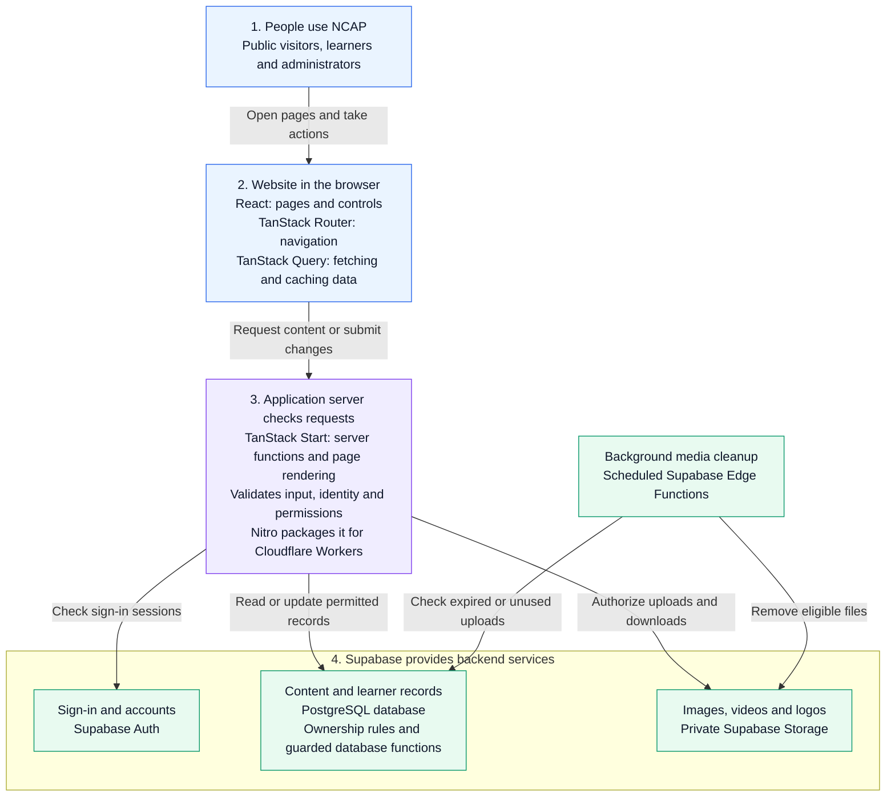

# NCAP — National Cybersecurity Awareness Platform

[](https://github.com/rizad-mohamed/NCAP/actions/workflows/ci.yml)
[](package.json)

NCAP is a Sri Lanka-focused cybersecurity awareness, learning and assessment platform. It helps the public find practical guidance, learners build and assess knowledge, and administrators maintain content, accounts and programme reports. This repository contains **NCAP v1.0 (Foundation Release)**: a responsive application with Supabase-backed core workflows, undergoing production-release preparation.

Project initiation and foundation development through the current `ncap_v1.0` were carried out by [Rizad Mohamed](https://www.linkedin.com/in/rizad-mohamed/).

NCAP is not an official incident-reporting channel or a substitute for approved government cybersecurity policy.

Application communications/localization changes and staging operations are documented in [Announcements, notifications, localization and media](supabase/COMMUNICATIONS_LOCALIZATION.md).

The frontend uses the approved NCAP UI/UX design system across public, learner and administrator screens. Its implementation and release verification are documented in [Catalogue and workspace refinement](docs/CATALOGUE_UI_REFINEMENT.md) and [UI/UX release verification](docs/UI_UX_RELEASE.md). This frontend promotion does not change the production-readiness status below.

Application cleanup, measured optimizations, regression evidence and unresolved security-audit limits are documented in [Application hardening](docs/APPLICATION_HARDENING.md).

## Project status

**As of 8 October 2026: production release is BLOCKED.** Core features and backend migrations have staging verification; public production deployment has not been performed or certified by the current release evidence.

- **Backend:** Supabase staging, with Auth, profiles, Awareness, Learning, Quiz, Dashboard, Users, Reports, Certificates and Announcements persistence.
- **Application:** Nitro Cloudflare Worker build exercised locally against staging. Remote public HTTPS hosting and deployed-origin checks remain outstanding.
- **Quality:** the `main` workflow runs checks, build, dependency/secret review and default browser tests. Authenticated staging tests are opt-in; a green CI badge does not certify email delivery or production infrastructure.
- **Release decision:** [Authentication verification](supabase/AUTHENTICATION_VERIFICATION.md) and [full-stack verification](supabase/FULL_STACK_VERIFICATION.md) define the current gates. Newer authentication work resolves the older report's missing durable account-audit identities and supersedes its exclusion of authentication.

### Completion estimate

These are **engineering estimates**, not measured coverage, certification or production approval. They concern the current Foundation Release scope, excluding later national-platform ambitions.

| Area                                      | Estimate | Evidence and remaining work                                                                                                                                                |
| ----------------------------------------- | -------: | -------------------------------------------------------------------------------------------------------------------------------------------------------------------------- |
| Core features / frontend UX               |      95% | Principal public, learner and admin workflows exist; approved localization coverage and native media/device validation remain.                                             |
| Backend / full-stack                      |      95% | Authoritative persistence, guarded RPCs, RLS and staging workflows exist; durable announcement audit and in-app notifications now exist; scale boundaries remain.          |
| Security / testing maturity               |      85% | Database, IDOR, cross-browser, secret/dependency and accessibility checks exist; delivered email, CAPTCHA, native Safari media, load testing and further hardening remain. |
| Production / operations readiness         |      35% | Worker target, staging migrations and cleanup are present; public hosting, SMTP, monitoring and proven recovery are unverified.                                            |
| **Overall Foundation Release completion** |  **84%** | Weighted estimate: features 35%, backend 30%, security/testing 20%, operations 15%; weighted total 84%.                                                                    |

Estimates derive from current source/service paths, 25 versioned migrations through `202610080001`, test infrastructure and the latest verification records. Operational gates remain mandatory regardless of the overall percentage.

## Feature and module status

**Implemented** means code and persistence exist. **Staging verified** refers to documented scenarios, not exhaustive production validation. Historical catalogue counts describe seed/verification snapshots, not a guaranteed current inventory.

Documented catalogue baselines include 60 Awareness resources across seven types, 11 Learning topics, five modules and 18 lessons, and five quizzes with 48 questions. Administrator edits can change these totals. Responsive layouts, keyboard navigation, reduced-motion support and automated reflow/accessibility checks remain part of the interface foundation.

| Module                            | Implemented behavior                                                                                                                                                                                                                                                                                                                                                                                                          | Verification boundary / remaining work                                                                                                                                                                                                                                                                                                             |
| --------------------------------- | ----------------------------------------------------------------------------------------------------------------------------------------------------------------------------------------------------------------------------------------------------------------------------------------------------------------------------------------------------------------------------------------------------------------------------- | -------------------------------------------------------------------------------------------------------------------------------------------------------------------------------------------------------------------------------------------------------------------------------------------------------------------------------------------------- |
| User / Authentication             | Registration, verification/resend, login/logout, PKCE callback, recovery/reset, server-validated sessions, remember-me cookie lifetime, persistent profile/preferences/interests/avatar, learner/Super Admin authorization, active-account checks, shared rate counters and account audit. Password changes verify current password; recovery requires recent verified recovery evidence; other refresh sessions are revoked. | Core API/database and disposable authenticated lifecycle verified in staging. Real delivered verification/recovery email, production SMTP, HTTPS origins/redirects, CAPTCHA tokens and deployed ingress remain release gates. No self-service account deletion screen.                                                                             |
| Awareness                         | Articles, Cyber Tips, Demo Updates/news, Best Practices, Posters, Infographics and Videos; search/type/topic filtering, admin CRUD, publication, version conflicts, audit and managed private media.                                                                                                                                                                                                                          | Persistent backend and staging authoring/media checks. Demo Updates is a resource type, not a claim that Awareness data is browser-local. Seed transcripts/chapters do not supply licensed production video binaries.                                                                                                                              |
| Learning                          | Topics, modules, lessons, typed content blocks, knowledge checks, transcripts, account-owned progress/completion/bookmarks/activity, video resume, media, admin authoring and publication.                                                                                                                                                                                                                                    | Staging persistence, isolation and authoring verified. Published lesson content is readable through public Data API policies even though the lesson UI requires sign-in; progress remains private.                                                                                                                                                 |
| Quiz                              | Published catalogue, server deadlines, randomized question selection, persistent attempt snapshots/answers and resume, server scoring, history/results, retake limits/cooldowns and admin quiz/question CRUD/publication.                                                                                                                                                                                                     | Staging API/browser verified. Private answer/attempt internals deny direct client reads. Old browser-demo attempts are not imported as verified results. Catalogue/history aggregation and polling need load evaluation.                                                                                                                           |
| Dashboard / learner progress      | Authoritative progress, completed lessons, quiz scores, server-measured learning hours, earned badges, paginated activity, next-lesson recommendations and admin overview analytics.                                                                                                                                                                                                                                          | Staging verified. Recommendations are deterministic; time before the time-session migration cannot be reconstructed. Focus/visibility heartbeats and one open session prevent multiplying credit through tabs.                                                                                                                                     |
| Administrator — Users             | Real Auth identities/profiles, name/email search, role/status filters, server sorting/pagination, Learning/Quiz detail aggregates, role/status controls, restriction reasons and transactional audit.                                                                                                                                                                                                                         | Staging authorization and account lifecycle verified. Self-access changes are denied; the final active Super Admin is protected. Durable actor/target UUID snapshots survive deletion; earlier missing identities cannot be reconstructed.                                                                                                         |
| Administrator — Lessons / Content | Learning topics/modules/lessons, quiz questions and Awareness workspaces; publish/unpublish, previews, typed editing, optimistic versions, audit snapshots and managed media.                                                                                                                                                                                                                                                 | Staging CRUD/preview verified. Defined transactional deletion and learner-state cascades require confirmation; snapshots are revision evidence, not a rollback UI. No approval hierarchy or scheduled content-publication workflow.                                                                                                                |
| Administrator — Reports           | Authoritative profile, Learning and Quiz sources; date/module/quiz filters, charts/tables, paginated rows, filtered CSV and print; active Super Admin checks on server and database.                                                                                                                                                                                                                                          | Staging filters/export/print and authorization verified. Pages are bounded at 100 rows; CSV rejects more than 10,000 filtered rows rather than truncating. Central durable export-event auditing is absent.                                                                                                                                        |
| Administrator — Certificates      | 100% published module-lesson completion and best quiz score ≥80% eligibility; persistent registry, issuance, duplicate protection, immutable evidence/template snapshots, revocation, owner visibility, anonymous reference verification, audit and server PDF.                                                                                                                                                               | Staging lifecycle and Latin/Sinhala/Tamil PDF rendering verified. Public verification omits learner identity. Registry verification is not external cryptographic signing or official accreditation. PDFs are generated on demand, not stored.                                                                                                     |
| Administrator — Announcements     | Database persistence, admin create/edit/delete, active dates, audience selection (All Learners, New Learners, Administrators), and learner Dashboard display filtered by dates/audience.                                                                                                                                                                                                                                      | Schedule/audience rules exist; learner display verified in staging. Durable mutation snapshots, idempotent audience delivery and per-user read state now exist.                                                                                                                                                                                    |
| Media / uploads                   | Private Awareness/Learning buckets, authorized signed upload/read URLs, validation/finalization, immutable paths, transactional replacement and scheduled abandoned/retired-object cleanup.                                                                                                                                                                                                                                   | Staging upload/signing/replacement/cleanup verified. Limits and URL/cache revocation boundaries are below. No transcoding or malware-scanning pipeline.                                                                                                                                                                                            |
| Localization                      | English (`en`), Sinhala (`si`) and Tamil (`ta`) language selection, saved profile language, document language and dictionaries for selected navigation/auth/action/dashboard strings; local fonts.                                                                                                                                                                                                                            | Interface lookups cover public/auth/learner/admin screens; missing approved Sinhala/Tamil strings and authored variants explicitly retain originals. Certificate PDFs support Latin, Sinhala and Tamil text; other scripts return validation errors. Draft/Published variants, source-version review and safe original-content fallback now exist. |
| Notifications                     | Persistent in-app notifications, announcement event keys, owner-only read state, unread badge/history and profile notification preference; Auth email request/callback flows.                                                                                                                                                                                                                                                 | Persistent in-app inbox/read state, unread counts, cursor pages and preference-aware audience delivery are implemented. Push/SMS/application email remain deferred; Auth inbox delivery remains unverified.                                                                                                                                        |
| Security                          | Auth/cookie controls, RLS, independent server/RPC authorization, CSRF, typed input validation, throttling, domain audit, private media, safe errors, dependency/secret scanning and authorization/IDOR tests.                                                                                                                                                                                                                 | Significant automated/staging coverage; production controls and residual hardening remain. No formal SOC or penetration-test certification.                                                                                                                                                                                                        |
| Testing                           | Vitest/Testing Library, PGlite PostgreSQL/RLS integration, live hosted checks, Playwright across five browser profiles, axe/reflow checks, Lighthouse review and security scans.                                                                                                                                                                                                                                              | Default CI excludes privileged staging scenarios without opt-in. Browser emulation is not physical-device evidence; Windows WebKit media limitations are explicit.                                                                                                                                                                                 |
| Deployment / operations           | Supabase staging migrations/seeds, cleanup Edge Functions and hourly scheduling; Cloudflare Worker target and GitHub validation pipeline.                                                                                                                                                                                                                                                                                     | CI validates builds; it does not publish the application. Public HTTPS hosting, production secrets/origins, monitoring/alert delivery and database plus Storage recovery drills remain unverified.                                                                                                                                                 |

## Runtime architecture

**NCAP is a full-stack React application built with TanStack Start. It does not use Next.js.** The browser displays the interface, the application server checks requests, and Supabase stores identities, records and media.

Read the diagram from top to bottom. Each box describes a responsibility first, with the technology underneath. Arrows show requests; results return to the user through the application.



For example, completing a lesson sends a request from the browser to a TanStack Start server function. The server checks the signed-in account, and the database enforces permissions before saving progress. The interface then refreshes the learner's progress. For media, the server authorizes a temporary signed URL; the browser uploads or reads the file directly from private Storage.

The same architecture serves Authentication, Awareness, Learning, Quiz, Dashboard, administrator Users, Reports, Certificates and Announcements. Awareness and Learning use repository adapters; the other main domains use dedicated server-function/query hooks. Legacy seed/demo adapters remain in the tree but are not authoritative records for these workflows.

The backend has two cooperating parts: **TypeScript application services** handle requests and validation; **Supabase PostgreSQL** provides persistence, row-level security (RLS) and guarded remote procedure calls (RPCs) for transactional rules such as quiz scoring and certificate eligibility. There is no separate Express or NestJS application.

Sessions use server-managed cookies. Normal session/profile/domain requests use the publishable key with the user's identity and database policies. Only shared authentication throttling uses the server service-role client in the application. Maintenance Edge Functions use privileged server credentials separately.

**Deployment boundary:** Cloudflare Workers is the configured application hosting target, not a claim of completed public deployment. The built Worker has been tested locally against Supabase staging.

## Technology stack

The versions below are resolved versions from the committed [package-lock.json](package-lock.json), verified against the hardening lockfile on 8 October 2026; retained package versions were unchanged. [package.json](package.json) declares dependency ranges and scripts; ranges can differ from resolved versions. Supabase-managed PostgreSQL/Auth/Storage and Cloudflare services do not have application dependency versions in this lockfile.

### Frontend and full-stack framework

[](#frontend-and-full-stack-framework)
[](#frontend-and-full-stack-framework)
[](#frontend-and-full-stack-framework)
[](#frontend-and-full-stack-framework)
[](#frontend-and-full-stack-framework)

| Technology              | Resolved version                        | What it does in NCAP                                         |
| ----------------------- | --------------------------------------- | ------------------------------------------------------------ |
| 🔷 TypeScript           | 5.9.3                                   | Typed frontend and server application code                   |
| ⚛️ React / React DOM    | 19.2.8                                  | Renders the interface                                        |
| **TanStack Start**      | **1.168.32**                            | **Project framework:** server rendering and server functions |
| TanStack Router         | 1.170.18                                | Typed, file-based navigation                                 |
| TanStack Query          | 5.102.8                                 | Server-data fetching, caching and mutations                  |
| Tailwind CSS            | 4.3.3                                   | Styling and responsive layouts                               |
| Radix UI / Lucide React | Component-specific versions in lockfile | Accessible UI primitives and icons                           |
| Zod                     | 3.25.76                                 | Input validation; forms use React state                      |
| Recharts                | 2.15.4                                  | Administrator charts                                         |

### Backend, build and hosting

[](#backend-build-and-hosting)
[](#backend-build-and-hosting)
[](#backend-build-and-hosting)
[](#backend-build-and-hosting)

| Technology                               | Resolved version / service   | What it does in NCAP                                                |
| ---------------------------------------- | ---------------------------- | ------------------------------------------------------------------- |
| TanStack Start server functions          | 1.168.32                     | Request handling, validation, authorization and domain services     |
| Vite                                     | 8.1.5                        | Development server and application builds                           |
| Nitro                                    | 3.0.260603-beta              | Packages the server for the Cloudflare Worker target                |
| ☁️ Cloudflare Workers / Wrangler         | Hosting target / CLI 4.147.0 | Application runtime target and local Worker tooling                 |
| Supabase PostgreSQL                      | Managed database             | Persistent records, RLS, grants, constraints and transactional RPCs |
| Supabase Auth                            | Managed identity service     | Registration, sign-in, verification, recovery and refresh sessions  |
| Supabase Storage                         | Managed object storage       | Private media and signed upload/download URLs                       |
| Supabase Edge Functions / scheduled jobs | Managed maintenance services | Background media cleanup                                            |
| Supabase JS / Supabase SSR               | 2.116.0 / 0.12.7             | Backend requests and cookie-based session integration               |
| pdf-lib / fontkit                        | 1.17.1 / 1.1.1               | Server-generated certificates with font support                     |

### Testing, quality and development tools

[](#testing-quality-and-development-tools)
[](#testing-quality-and-development-tools)
[](#testing-quality-and-development-tools)
[](#testing-quality-and-development-tools)
[](#testing-quality-and-development-tools)

| Technology              | Resolved version / configuration         | Purpose                                                           |
| ----------------------- | ---------------------------------------- | ----------------------------------------------------------------- |
| Vitest                  | 4.1.11                                   | Unit and integration tests                                        |
| Testing Library / jsdom | Package-specific versions in lockfile    | Component tests and simulated browser environment                 |
| PGlite                  | 0.5.8                                    | PostgreSQL migration, RLS and RPC integration tests               |
| Playwright              | 1.62.1                                   | Browser end-to-end tests                                          |
| axe-core / Lighthouse   | Package-specific / review-script tooling | Accessibility and performance checks                              |
| ESLint / Prettier       | 9.39.5 / 3.9.6                           | Linting and formatting                                            |
| GitHub Actions          | Node 22 CI workflow                      | Checks, build, security review and default browser suite          |
| Node.js / npm           | Node ≥22; npm with committed lockfile    | Development/build tooling; application deployment targets Workers |

Custom secret scanners and npm dependency audits complement these tools. Lighthouse is invoked separately by the review script, not by default CI. Self-hosted Atkinson Hyperlegible and Noto Sans Sinhala/Tamil fonts support interface and certificate text.

## Repository structure

Paths are relative to the Git repository root (the IDE folder may be named `ncap_v1.0`).

```text
.github/workflows/      CI validation
design-system/         Design reference and guidance
e2e/                   Playwright scenarios and fixtures
public/                Static assets, fonts and headers
scripts/               Deployment, seed, cleanup and security tools
src/
  auth/                Session contracts and authentication UI state
  components/          Shared interface components
  data/                Types and original seed/demo content
  domain/              Validation and domain rules
  features/            Public, learner and administrator interfaces
  routes/              Typed file-based routes and HTTP endpoints
  server/              Server-only Auth and domain services
  services/            Repository adapters and query hooks
  state/               Application state and preferences
  *.functions.ts       TanStack server-function entry points
supabase/
  functions/           Protected media-cleanup Edge Functions
  migrations/          Ordered schema, grants, policies and RPCs
  *seed.sql            Catalogue seed SQL
```

## Database and backend

Supabase Auth owns identities; profile triggers create learner profiles and synchronize email. Privileged roles cannot be assigned through registration metadata. PostgreSQL owns content, learner state, attempts, announcements, badges, certificates and audit records.

RLS and restricted grants protect direct Data API access. Server functions validate input and active authoritative profiles; guarded RPCs independently authorize sensitive actions and perform transactional changes. Quiz answers/scoring and certificate eligibility are database-controlled. Definer functions use protected search paths. The PostgREST pre-request hook rejects inactive accounts with older JWTs.

Learning, Quiz and Awareness use optimistic versions and audit evidence. User role/status, certificate issue/revoke/template changes, announcement mutations, notification generation and content translation changes are audited; centralized denied-action/export events remain a gap. Account-security and communications audit UUID snapshots survive profile deletion; this does not guarantee identical retention across all domain audits.

Private Storage holds managed media; PDFs are generated from stored snapshots. Backend migrations are forward corrections with recorded history. Read [authentication setup](supabase/README.md) and module operations guides before changing schema, roles or media policies.

## Environment configuration

Copy the placeholder-only [.env.example](.env.example) to ignored `.env.local`. This table lists **names and purposes only**; obtain actual values from the environment owner.

| Variable                    | Scope / purpose                                                                                                                 |
| --------------------------- | ------------------------------------------------------------------------------------------------------------------------------- |
| `SUPABASE_URL`              | Application runtime: backend endpoint; public configuration, not a credential                                                   |
| `SUPABASE_PUBLISHABLE_KEY`  | Application runtime: client-safe key; user RLS still applies                                                                    |
| `APP_URL`                   | Application runtime: canonical origin, redirects and origin-aware output; HTTPS required except localhost/127.0.0.1 development |
| `SUPABASE_SERVICE_ROLE_KEY` | **Server-only host secret:** required for shared Auth throttling; also used by authorized operator/test and cleanup tools       |
| `AUTH_TRUST_PROXY`          | Server-only ingress setting: `cloudflare` only behind trusted ingress that overwrites `cf-connecting-ip`                        |
| `SUPABASE_ACCESS_TOKEN`     | **Operator-only secret:** Supabase management deployment/verification tools; not application runtime configuration              |
| `AWARENESS_CLEANUP_TOKEN`   | **Edge Function / scheduler secret:** Awareness maintenance authorization                                                       |
| `LEARNING_CLEANUP_TOKEN`    | **Edge Function / scheduler secret:** Learning maintenance authorization                                                        |

`.env`, other `.env.*`, `.dev.vars` and local operator/test files are ignored except `.env.example`. Keep privileged credentials in ignored local files or host/service secret configuration. **Never commit them, put them in `VITE_` variables, expose them to frontend bundles, or log them.** Server import protection rejects client imports of `src/server/` code.

Missing throttle secrets or unavailable throttle service fail Auth mutations closed. Local HTTP uses a shared development source; other HTTPS hosts need an implemented trusted-source adapter. SMTP and CAPTCHA need provider configuration; current forms do not yet submit CAPTCHA tokens.

## Local development

Use **Node.js 22 or newer** and npm with the committed lockfile. A configured Supabase project with ordered migrations is required for backend features; demo fixtures do not substitute for it.

```sh
git clone https://github.com/rizad-mohamed/NCAP.git
cd NCAP
npm ci
cp .env.example .env.local
```

In PowerShell use `Copy-Item .env.example .env.local`; if execution policy blocks npm's PowerShell wrapper, use `npm.cmd`. Configure the variables above, apply documented staging schema/catalogues, and provision the first Super Admin using [the setup guide](supabase/README.md).

```sh
npm run dev
```

Development serves `http://localhost:8080`. Set the development origin and exact Auth callbacks consistently; browser E2E uses a separate built Worker at `http://127.0.0.1:4173`. The documented staging Auth allowlist is for that test Worker, so adjust it deliberately for another local origin.

| Command                                                                  | Purpose                                                   |
| ------------------------------------------------------------------------ | --------------------------------------------------------- |
| `npm run dev`                                                            | Vite development server on port 8080                      |
| `npm run build`                                                          | Production Nitro/Cloudflare output in `.output`           |
| `npm run preview`                                                        | Vite build preview; E2E uses Wrangler instead             |
| `npm run typecheck` / `npm run lint`                                     | TypeScript and ESLint checks                              |
| `npm test` / `npm run test:watch`                                        | Vitest run / watch                                        |
| `npm run security:scan`                                                  | Repository secret-pattern scanner                         |
| `npm run check`                                                          | Typecheck, lint, tests, secret scan and build             |
| `npm run test:e2e`                                                       | Build and run Playwright                                  |
| `npm run format`                                                         | Format supported repository files; modifies files         |
| `npm run awareness:seed` / `npm run learning:seed` / `npm run quiz:seed` | Documented operator catalogue import/generation workflows |
| `npm run awareness:cleanup` / `npm run learning:cleanup`                 | Documented operator media maintenance                     |

Review seed/cleanup guides before running them remotely. An empty backend needs both schema and catalogue setup.

## Database and migration workflow

1. Inspect history and choose isolated **staging** first. Apply filenames in ascending order: Auth/profiles → Awareness → Learning → Quiz → Dashboard/Users → Reports/Certificates/audit → Auth finalization.
2. Use documented Supabase SQL Editor/CLI workflows or repository operator scripts. Scripts inspect dependencies and record migrations transactionally. They are not all general production deployers: authentication mutation scripts refuse projects other than confirmed staging.
3. Import Learning before Quiz, which references module IDs. Seed workflows use stable identities and documented conflict behavior to preserve edits; never import fabricated learner history or demo certificates.
4. Verify history, grants/RLS, RPC authorization and workflows, then promote reviewed forward migrations through an operator-controlled release process.

Existing operator verification commands include:

```sh
node scripts/auth-deploy.mjs inspect
node scripts/users-deploy.mjs verify
node scripts/admin-modules-deploy.mjs verify
```

These need operator configuration and remote access. For staging apply modes, seed flags, maintenance provisioning and recovery use [Auth](supabase/README.md), [Awareness](supabase/AWARENESS.md), [Learning](supabase/LEARNING.md), [Quiz](supabase/QUIZ.md), [Dashboard](supabase/DASHBOARD.md), [Users](supabase/USERS.md) and [administrator modules](supabase/ADMIN_MODULES.md).

**Do not destructively reset populated environments or rerun initial schema SQL blindly.** Preserve applied migrations and add forward corrections. A local snapshot or seed catalogue is not a database-and-object backup.

## Media and authoring

The lesson editor supports headings, paragraphs, lists, callouts, examples, knowledge checks, ordering, deletion and undo/redo. Content renders as escaped text. Lessons accept HTTPS YouTube/Vimeo links, direct HTTPS MP4/WebM URLs and managed uploads; published video lessons require transcripts. Native playback supports speed, fullscreen, persisted resume and completion on ending.

| Asset                       | Current limits / storage                                                                                                                            |
| --------------------------- | --------------------------------------------------------------------------------------------------------------------------------------------------- |
| Awareness / Learning images | JPEG/PNG/WebP; 5 MiB; 4096 × 4096 pixels; validated metadata and alt text                                                                           |
| Learning video              | MP4/WebM; 50 MiB; four hours; private `learning-media`                                                                                              |
| Awareness video             | MP4/WebM; product/bucket ceiling 100 MiB and four hours, but documented staging project ceiling is **50 MiB per upload**; private `awareness-media` |
| Profile avatar              | Inline JPEG/PNG/WebP in protected profile JSON; 256 KiB; 1024 × 1024; raster validation and database constraints; removal saves null                |
| Certificate logo / PDF      | Optional PNG/JPEG logo reuses private Learning media; PDF generated server-side, with no stored PDF lifecycle                                       |

Upload preparation/finalization validate size, MIME/signature, dimensions and video metadata. Replacement attaches new objects transactionally and retires unreferenced old objects. Protected scheduled Edge Functions clean expired abandoned uploads and retry retired objects; failures retain queue entries.

Issued signed URLs remain usable until expiry after unpublishing; CDN-cached responses may outlast origin deletion. Learning image URLs last 60 seconds and videos last validated duration plus five minutes (up to four hours five minutes). Container inspection has bounded metadata requirements; unsupported files may need re-exporting. Transcoding, synchronized caption tracks, malware scanning and licensed production video supply are not complete services. Native macOS/iOS Safari media remains unverified.

## Testing and quality

The final local hardening run passed **319 unit/integration tests with two opt-in hosted tests skipped**; the two hosted Awareness tests passed separately on staging. Final validation and earlier failed-run dispositions are recorded in [Application hardening](docs/APPLICATION_HARDENING.md). Counts are dated run results, not exhaustive coverage; opt-in skips do not represent passing hosted coverage. Older module counts describe earlier revisions.

- **Unit/component/integration:** Vitest and Testing Library cover rules, safe errors, query behavior, Auth actions, media and PDFs.
- **Database/RLS:** PGlite applies production PostgreSQL migrations to test ownership, grants, RPCs, transactions, scoring, account safeguards and audit. Live staging tests cover hosted Auth/Storage behavior PGlite cannot fully emulate.
- **Browser:** Playwright tests built Workers across Chromium, Firefox, WebKit, Mobile Chrome and Mobile Safari. Authenticated workflows use disposable staging accounts; traces are disabled for the Auth credential lifecycle. Default skips are not passing live coverage.
- **Accessibility/performance:** axe, viewport/reflow checks and Lighthouse lab review. The final hardening lab run records accessibility 100, best practices 100 and CLS 0 on eight routes; homepage mobile-lab LCP was 3.85 s, with material variation across repeated runs. Historical 8.83 s belongs to an earlier revision. These are not production SLAs or complete manual accessibility audits.
- **Security:** authorization/IDOR and active-account regressions, repository/history/build secret scans and npm dependency audit.

```sh
npm run check
npm audit --audit-level=moderate
node scripts/security-review.mjs
npx playwright install
npm run test:e2e
```

With an existing build, `npx playwright test` runs the browser configuration. `node scripts/lighthouse-review.mjs` performs separate lab review; it needs the built Worker, Chromium and disposable staging configuration for authenticated routes and invokes Lighthouse through npm. Read [full-stack verification](supabase/FULL_STACK_VERIFICATION.md) before live tools; they mutate disposable accounts/content and must not target production users.

[Frontend checks](.github/workflows/ci.yml) runs on pushes and pull requests with Node 22: `npm ci`, `npm run check`, dependency audit, extended secret review, browser installation and default Playwright. Vitest and CI browser workers are bounded at two. CI does not deploy the Worker, run privileged staging fixtures by default, certify delivered email, or run Lighthouse.

## Security

Sessions are validated server-side against Supabase Auth and active authoritative profiles. Cookies force HttpOnly/SameSite=Lax and Secure on HTTPS; remember-me chooses session versus persistent expiry. Auth callbacks are uncached, suppress referrers and reject unsafe redirects. Authenticated domain responses are private/uncached. CSRF middleware, HTTPS-aware security headers, Zod validation, restricted grants and RLS supplement server authorization.

Shared attempt counters are atomic, service-only and keyed with HMAC digests rather than raw identities/IPs. Source and action/identity bounds fail closed; native Auth limits govern direct Supabase calls. Deployers must review trusted ingress, upstream limits and proxy egress behavior. Private objects require authorized signing; safe errors omit database details.

Refresh-token revocation does not instantly invalidate every issued JWT; suspended-account checks block application/Data API use, but the request hook does not cover Storage or Realtime. Future private policies there must enforce active status. CSP still permits inline scripts/styles; MFA and nonce-based CSP are future hardening. Announcement mutations and content translations have dedicated audit history; centralized durable denied-action/export events remain absent. Define retention/export policy before privileged account deletion cascades dependent records. No formal security certification is claimed.

For responsible disclosure, contact the repository maintainer privately through the [maintainer profile](https://github.com/rizad-mohamed). Do not publish credentials, personal data or actionable vulnerability details in public issues. No formal security-response SLA is currently defined.

## Deployment and production-release gates

The build targets the `ncap-v1-0` Cloudflare Worker through Nitro's generated Wrangler configuration. Backend staging migrations and protected hourly media cleanup are deployed according to verification reports; cleanup permission corrections passed live checks. GitHub Actions validates changes but contains no application deployment job. Production hosting/runtime configuration remains an operator task.

Before public release:

1. **HTTPS hosting:** deploy the Worker, configure secrets/trusted ingress, align `APP_URL`, Supabase Site URL and exact callbacks, then verify cookies, CSRF, cache/security headers, redirects and public/learner/admin workflows on that origin.
2. **Delivered Auth lifecycle:** configure production SMTP/sender domain and verify inbox/spam delivery, verification/resend, real recovery, expiry/replay denial and reset across supported browsers. PKCE links require the initiating browser; cross-device behavior is uncertified.
3. **Bot/abuse protection:** supply CAPTCHA site key/secret and implement token submission before enabling Auth CAPTCHA. Review native Auth limits and supported IP forwarding with the deployed topology.
4. **Recovery:** assign owners/recovery objectives; establish database **and Storage object** backups, retention and isolated restore drills. Last recorded inventory had no listed database backups and PITR disabled; restore proof is unavailable. Database metadata alone does not back up object bytes.
5. **Operations:** verify monitoring, cleanup-failure alert delivery, quotas, on-call/incident response and session-revocation procedures. Cron dispatch success alone is not cleanup or alerting evidence.
6. **Acceptance evidence:** close or explicitly disposition homepage performance, native Safari/physical-device media and manual assistive-technology validation, and representative load/scalability testing before broader release-quality claims.

Production readiness remains blocked even when local checks and staging workflows pass.

## Roadmap

| Priority                  | Remaining scope                                                                                                                                                                                                                                                                                                                              |
| ------------------------- | -------------------------------------------------------------------------------------------------------------------------------------------------------------------------------------------------------------------------------------------------------------------------------------------------------------------------------------------- |
| Before production release | HTTPS/runtime/origins; SMTP and delivered Auth lifecycle; CAPTCHA integration; trusted ingress/quotas; monitoring/alerting; database/object recovery and incident procedures; acceptance evidence above.                                                                                                                                     |
| Near-term improvements    | Durable denied-action/export events; homepage image/JavaScript optimization; measured catalogue/history pagination/polling improvements; native Safari media and physical-device/manual accessibility checks; reviewed Sinhala/Tamil interface/content coverage; external notification channels; MFA/CSP hardening and retention governance. |
| Future platform evolution | Historical requirements discuss national/sector analytics, benchmarking, risk profiling, adaptive learning and policy-support indicators. These remain outside Foundation Release scope and need approved requirements, privacy/governance and data design before implementation.                                                            |

No AI recommendation engine, national Cybersecurity Index, push/SMS delivery, cryptographically signed certificate service or formal compliance certification is claimed.

## Documentation and contribution

Use source/migrations and newer verification records to resolve conflicts with historical audits. Tie README changes to evidence, preserve accessibility/content integrity and run relevant checks before contributing. Follow [repository guidance](AGENTS.md); preserve published history and exclude local artifacts/credentials.

- [Authentication setup](supabase/README.md) and [current verification / release gates](supabase/AUTHENTICATION_VERIFICATION.md)
- [Full-stack QA, security, browser and Lighthouse verification](supabase/FULL_STACK_VERIFICATION.md)
- [Awareness operations](supabase/AWARENESS.md), [verification](supabase/AWARENESS_VERIFICATION.md) and [readiness](supabase/AWARENESS_READINESS.md)
- [Learning operations](supabase/LEARNING.md) and [verification](supabase/LEARNING_VERIFICATION.md)
- [Quiz deployment / authorization](supabase/QUIZ.md)
- [Dashboard / announcements deployment](supabase/DASHBOARD.md)
- [Administrator Users operations](supabase/USERS.md)
- [Administrator content, reports and certificates](supabase/ADMIN_MODULES.md)
- [Backend reference architecture](supabase/AWARENESS_REFERENCE_ARCHITECTURE.md)
- [Original intelligence / gap audit](PROJECT_INTELLIGENCE.md) and [historical implementation status](IMPLEMENTATION_STATUS.md) — these include superseded browser-demo descriptions
- [Design-system guidance](design-system/ncap-sri-lanka/MASTER.md)

## License

No license file is currently tracked, and `package.json` marks the package private without declaring a license. Public visibility does not itself grant an open-source license; obtain permission from the owner before redistribution. No license badge or terms are invented here.
